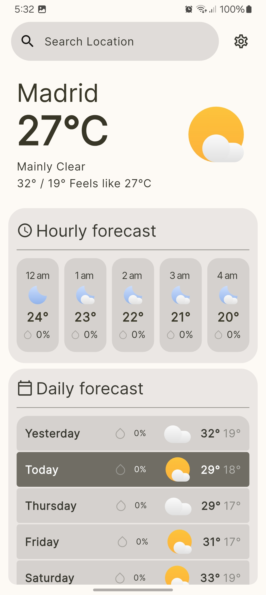
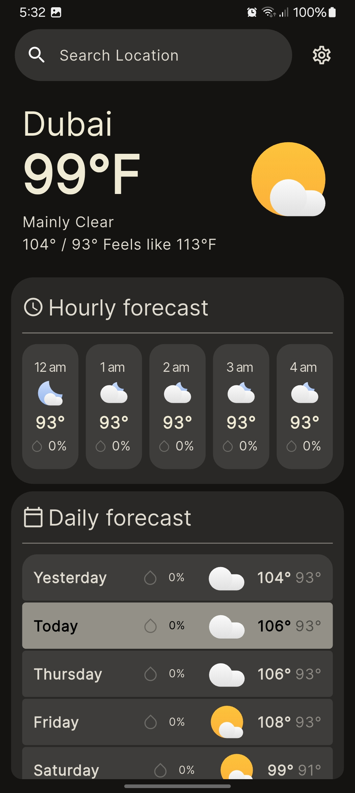
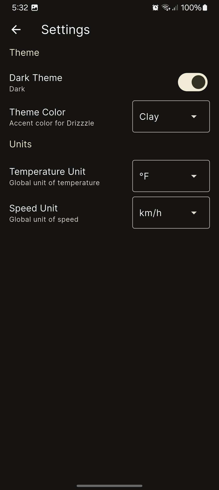
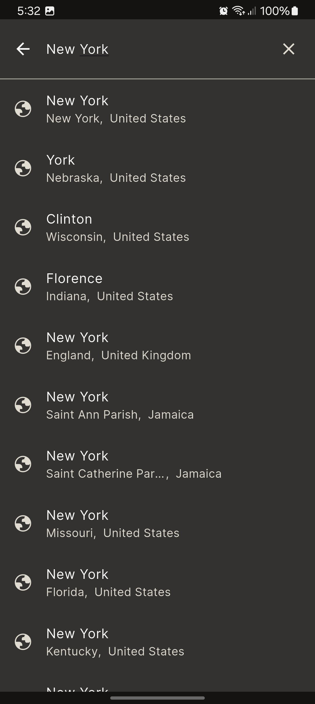

# Drizzzle

- Drizzzle is a weather app built with Flutter that follows Google’s Material Design principles. 

- It uses the [Open-Meteo](https://open-meteo.com/en/docs) Weather Forecast API to provide weather data.

## Preview

<div style="display: flex; gap: 20px;">
    
    
    
    
</div>

## Installation

1. Make sure you have Flutter installed. If not, you can follow the official [Flutter installation](https://docs.flutter.dev/get-started/install?_gl=1*15od0ed*_gcl_aw*R0NMLjE3NTUxODI1OTAuQ2p3S0NBandrdmJFQmhBcEVpd0FLVXo2LV9MY29ibHJuQUVVdEFrUEdDZVlsVlZtTm1iMHJhY0JDUkRKYVJBb1NYMzZuX2tOSG9qbW14b0NJSEVRQXZEX0J3RQ..*_gcl_dc*R0NMLjE3NTUxODI1OTAuQ2p3S0NBandrdmJFQmhBcEVpd0FLVXo2LV9MY29ibHJuQUVVdEFrUEdDZVlsVlZtTm1iMHJhY0JDUkRKYVJBb1NYMzZuX2tOSG9qbW14b0NJSEVRQXZEX0J3RQ..*_up*MQ..*_gs*MQ..*_ga*MTkwNzI2ODM1Ni4xNzI0NzUxNzk3*_ga_04YGWK0175*czE3NTUxODI1ODIkbzIyOCRnMSR0MTc1NTE4MjU5NyRqNDUkbDAkaDA.&gclid=CjwKCAjwkvbEBhApEiwAKUz6-_LcoblrnAEUtAkPGCeYlVVmNmb0racBCRDJaRAoSX36n_kNHojmmxoCIHEQAvD_BwE&gclsrc=aw.ds&gbraid=0AAAAAC-INI9YKN-If-rYVlqkQEeAa4h_n).

2. Clone this repository:
    ```
    git clone https://github.com/Dark-Tracker/drizzzle
    ```
3. Navigate to project directory:
    ```
    cd drizzzle
    ```
4. Fetch and install all the dependencies:
    ```
    flutter pub get
    ```
5. Run the app
    ```
    flutter run
    ```